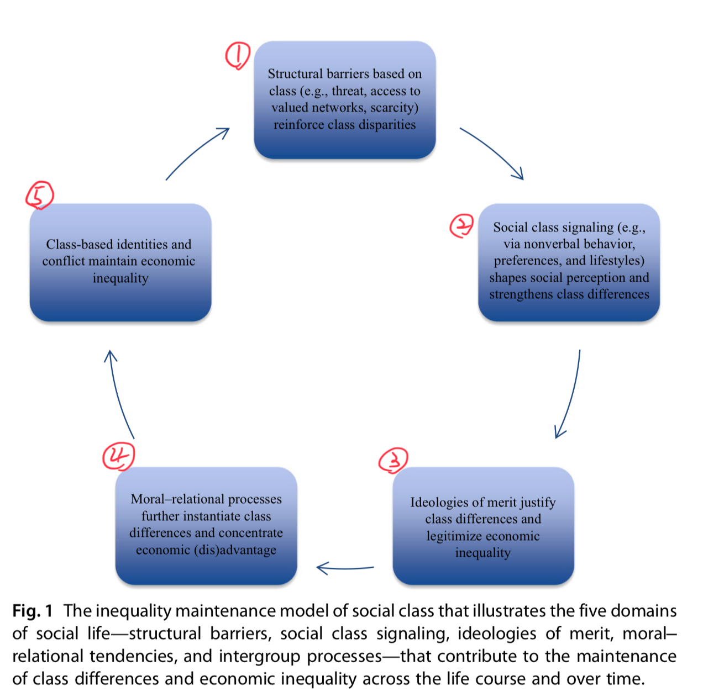

```{r, echo = FALSE}
source("../functions.R")
```


# Go back to index 
[Click here to go back](../Index.nb.html)

# Abstract 
**Inequality maintenance model of social class** --> 5 propositions to encapsulate the psychological processes that perpetuate class division in society (i.e., disparities between the rich nd the poor)

1. **Social processes that define social class**: 
  class-differentiated experiences of threat, scarcity, and access to valued networks enhance economic inequality by compounding (dis)advantage in education, work, and relationships
2. **Social perceptual processes**:
  how social class is signaled and perceived during social interactions, triggering class-based stereotypes and patterns of distancing that reinforce inequality
3. **Ideological processes**:
  how ideologies of merit legitimize economic inequality and bolster class division
4. **Moral-relational processes**:
  how class-based patterns of compassion, helping, and power seeking exacerbate economic inequality by concentrating resources among the upper class and constraining advancement among the lower class.
5. **Intergroup processes**:
   social class group identities catalyze difficulties in cross-class affiliation, asymmetric resource sharing, and class conflict, strengthening class division in society


# Intro 
Empirical evidence consistently finds that class background profoundly shapes one’s likelihood of educational success (e.g., Pascarella, Pierson, Wolniak, & Terenzini, 2004), health (Barr, 2014), and life expectancy (Chetty et al., 2016).

People prefer equality --> When given the option to allocate resources, people favor distributions of resources nearing equality over ones that are more inequitable or unfair (Fehr & Schmidt, 1999; Henrich et al., 2001; Rand, Greene, & Nowak, 2012).

**Def of ** `r colored("**Inequality prradox**", "cyan")`:

**_Why do social class hierarchies—hierarchies based on disparities of wealth, occupational prestige, and educational attainment—persist, and in the present context (at least in the United States), become more extreme, despite the facts that they are disfavored and detrimental to both society and the individuals who live within them (Wilkinson & Pickett, 2009)?_** 

(*def of social class: Throughout our review, we use the term social class to refer generally to a person’s standing vis-à-vis others in terms of educational attainment, wealth, and occupational prestige (e.g., Kraus, Piff, Mendoza-Denton, Rheinschmidt, & Keltner, 2012; Snibbe & Markus, 2005; Stephens, Markus, & Fryberg, 2012). Although social class is often measured continuously (e.g., income on a linear scale), for heuristic purposes we will use the terms “upper class,” “higher social class,” “rich,” or “haves” to refer to individuals who are of higher wealth, education, and occupational prestige, compared to indi- viduals who score relatively lower on these same indices and whom we will refer to as “lower class,” “poor,” or “have-nots,” recognizing there are `r colored("clear distinctions within these lower- and upper-class categories", "cyan")` (e.g., working-class poor vs unemployed poor; white vs non-white poor; underclass; inherited vs earned wealth; nouveau riche). When describing study findings, we will specify how the researchers measured social class (e.g., in terms of income, occupation, education, and subjective social class).*)

Underlying principle in this review: **hierarchies based on disparities of power and resources are self-perpetuating** 

--> `r colored("**Inquality Maintenance Model of Social Class**", "Gold")`

Questions that can be addressed by this model: <div class="sidenote"> *Note to self: <br> Can't people of high social class just be selfish and would not want to share resources with people of low social class? 既得利益者* </div>

  1. What psychological processes contribute to the persistence of economic inequality despite evidence that it is deleterious to social groups and collective efforts to mitigate it? 
  2. Why do first-generation students struggle with access to higher education? 
  3. Why is upward social mobility so difficult? Why are class and race so divisive in sociopolitical discourse? 
  4. What strategies might be leveraged to effectively achieve systemic change?   

# 1. Psychological conceptions of social hierarchy, power, and class 
Hierarchies are inherently *vertical* and *relational* --> they determine individual's privileged access to valued resources and influence 

Social class as *culture*: how through learning norms, values, and expectations, individuals come to embody the beliefs and behaviors that are shared by others of similar social class backgrounds

Social class as a *social-cognitive phenomenon*:Basic features of social class environments (e.g., survival and social threats, resource abundance or scarcity, social prestige or ostracism) give rise to class-differentiated patterns in cognition, affect, and behavior  

  High social class: greater perception of control and self-sufficiency, affect (decreased NA), and action (e.g., more trait-driven action)
  Low social class: experience greater threat and reduced opportunity --> increased vigilance to the external eenvrionment and other individuals and more other-oriented and often prosocial patterns of self-construal and behavior

Previous works: 
  
  - Subjective experiences (Kraus et al., 2012)
  - Social class identities (Destin et al., 2017, Jetten et al., 2017)^[Jetten, J., Haslam, S. A., Cruwys, T., Greenaway, K. H., Haslam, C., & Steffens, N. K. (2017). Advancing the social identity approach to health and well-being: Progressing the social cure research agenda. European Journal of Social Psychology, 47(7), 789–802. https://doi.org/10.1002/ejsp.2333
]
  - `r colored("Instant gratification", "gold")` (Belsky et al., 1991; Mullainathan & Shafir, 2014)^[Belsky, J., Steinberg, L., & Draper, P. (1991). Childhood experience, interpersonal develop- ment, and reproductive strategy: An evolutionary theory of socialization. Child Development, 62(4), 647–670.] ^[Mullainathan, S., & Shafir, E. (2014). Scarcity: The new science of having less and how it defines our lives. New York City, NY: Picador/Henry Holt.]
  - Relationship strategies (Bianchi & Vohs, 2016)^[Bianchi, E. C., & Vohs, K. D. (2016). Social Class and Social Worlds: Income Predicts the Frequency and Nature of Social Contact. Social Psychological and Personality Science, 7(5), 479–486. https://doi.org/10.1177/1948550616641472], attention to others (Dietze & Knowles, 2016) ^[Dietze, P., & Knowles, E. D. (2016). Social class and the motivational relevance of other human beings: Evidence from visual attention. Psychological Science, 27(11), 1517–1527.], even at the neural level (Varnum et al., 2016)
  - Response to other's suffering (Muscatell et al., 2012)^[Muscatell, K. A., Morelli, S. A., Falk, E. B., Way, B. M., Pfeifer, J. H., Galinsky, A. D., Lieberman, M. D., Dapretto, M., & Eisenberger, N. I. (2012). Social status modulates neural activity in the mentalizing network. NeuroImage, 60(3), 1771–1777. https://doi.org/10.1016/j.neuroimage.2012.01.080
]

Social class is not reducible to power (a person's relative control over resources and ability to influence others) or status (one's levels of respect and esteem). The correlation between social class and each of them is only samll to moderate (.10-.30)

People seem to conflate social class with other identities. (e.g, recipients of welfare are mentally represented to be African American more than non-recipients) --> this chapter points to important ways in which social class and race interact to perpectuare economic inequality <div class = "sidenote">Interaction of social class and race </div> 

# 2. Empirical traditions in the study of hierarchy maintenance (p.59)

# 3. An inequality maintenance model of social class 



The psychological processes by which individuals create and perpetuate social class hierarchies. 

  - `r colored("Why people act in ways that support the economic status quo even when it cannot benefit them?", "cyan")` 
  - `r colored("Why upper-class individuals might pursue greater personal advantage rather than the common good?", "cyan")` 
  - `r colored("What basic psychological processes lead people to justify and reinforce unfairness in society?)", "cyan")`
  
## Proposition 1: *Structural barriers* 

  - Social class organzies valued social institutions and determines people's access to desirable goods and services, opportunities, and valued social network 
    - &rarr; Factors that grant upper-class individuals priviledged access to opportunities for upward mobility while constraining those same opportunities for lower-class individials 
  - Differences in material conditions &rarr; class differences in *scarcity* elicit divergent psychological processes that *undermine efforts at upward mobility* among lower-class individuals and allow those at the top of the class hierarchy to ramain on top

## Proposition 2: *Class signaling and perception* 

  - `r colored("Aspirational signaling","cyan")`: People might expect upward mobility can happen as a result of signaling the class they aspire to *be* rather than the class they *are*  
    - this could be *problematic* &rarr; social class signaling can trigger class-based stereotypes and patterns of social distancing that reinforce class divisions 

## Proposition 3: *Ideologies of merit* 
  
  - Justify and maintain econmomic inequality 
  - People are suprisingly unaware of economic inequality 
  
## Proposition 4: *Moral and relational psychological processes*

  - upper-class individuals strategically perceive themselves and others and behave in ways (e.g., via self-gain, striving for positions of power) that prioritize individual over collective goals and exacerbate economic inequality by concentrating resources and opportunities among the upper class 
  - lower-class individuals constrain their own economic advancement through reduced self-focus and the shying away from power seeking.

## Proposition 5: *Intergroup processes*

  - structural segregation and social class signaling &rarr; form strong intergroup identities &rarr; social class identities guide social perception and interaction  
  
# 4. The structural barriers that define social class (p.63)

**Individuals from different social class groups live in objectively different social and ecological environments.**


## 4.1 H-I: Social institutions produce threat orientations among lower-class individuals that inhibit achievement and economic mobility (p.64)

Education:

  - upper-class students attend many if not most "elite" private colleges and universitys and lower-class students are almost alwys the clear numerical minority 
    - professors and staff are also more middle or upper class backgrounds 
    - &rarr; institutions don't know what lower-class students have to go through to be here 
      - e.g., the university slogna "choose your own educational path" is found off-putting by first-gen college students 
    - &rarr; elicit feelings of anxiety, threat-related neurophysiological responses, and a lack of belongingness 
  - lower-class students and families might expect rejection from these insitiutions 
  - stereotype threat 

Similar processes might also happen in other domains such as housing, health care,job application and interview, occupational reivew, and public policy 

Specifically, regarding public policy: 
  - interests of the poor are often underrepresented or altogether ignored in political discourse and policy 

## 4.2 H-II: Lower-class environments create scarcity mindsets that impair social and economic aspirations (p.67)
Scarcity mindsets &rarr; reducted capacity of <span style="color: cyan;">*delay gratification* </span>&rarr; constrained opportunities for economic advancement and mobility 

  - Def of scarcity: the *experience* of lacking something that is valued (cf. *perceived lack*)
    - It is cognitively taxing `r arr("r")` crowd out cog resources for planning and prob solving `r arr("r")` bad decision and/or self-defeating actions 
      - e.g #1 participants in the poor condition (had fewer guesses) performed worse in an unrelated cog taksks 
      - e.g #2 famers performe worse when their resources were meager compared to when they had abundant resources 
  - Anyone, irrespective of their genes or gifts, will exhibit the costs of scarcity when placed in an environment charcterized by it `r arr("r")` not inherent flaws 
  - The poor's tendency to take high-interest loan might be a reuslt of impaired cog resources for future planning 
  - Threat appraisal—as a result of scarcity—might lead lower-class individuals to minimize effor or avoid such situations altogether `r arr("r")` worser one's economic standing 
  
## 4.3 H-III: Upper-class environments produce cumulative (dis)advantgae through access to valued social networks of opportunity and influence

Advantage of access to valued social network `r arr("r")` **evident in educational context**
  
  - class boundaries, routines, norms, 
  - even with eqaul access to educational settings, normative behaviors for upper-class students might be foreign for lower-class students 
    - e.g., doing unpaid interships, travelling abroad, seeing a play, etc. 
  - principles of homophily `r arr("r")` people tend to affiliate with similar others 
    - couples are simiiar in their social class and they may have been linked with the same valued social network 
    - lower-class couples face higher risk of divorce and marital discord, as they often have more financial constraints 
  - **upper-class standing—irrespective of actual talent, competence, and proficiency—can directly lead to being advantaged in a highly valued social network: the job market.**
    - upper-class individuals might be seen as "better fit" with similar leisure activities, cultural knowledge, and background 

---
`r colored("**In sum, the very structural barriers that limit lower-class advancement favor upper-class individuals; they are preferentially granted increased opportunities to excel and advance when interacting with institutions that range from small groups (e.g., marriages) to large social networks (e.g., schools, clubs, and places of employment**)", "gold")`

# 5. Perceptual proessess of inequality maintenance 

**Humans have developed a rich, multichannel language of social class signals that relies on communication of cultural tastes, prefer- ences, and social behavior.**


## 5.1 H-IV:Social class is signaled and accuractely perceived during the early stages of social perception 

Humans signal social class through the communications of tastes and aesthetic preferences, as well as by patterns of social behavior.
  
  - These signals are expensive in and of themselves 
  - When revealed to be faked, they incur additional reputational costs for the signaler 
  - Aesthetic preferences for more expensive forms of clothing are sufficient to signal social class to others (e.g., shoes, make-up, hairstyle, outfit)
  <p></p>
  - Cultural and taste preferences are often communicated on social media, and veiwers can dervie social class info from posts on those platforms 
  - Labguage ability in children (higher-class compared to lower-class children: &uarr; vocab, &uarr; grammar, &uarr; ability to articulate their thoughts)
    - For upper-class individuals who can travel frequently, they demonstrate lingusitics that present "proper" or "cultured" forms of speech, whereas for lower-class individuals, their linguistic syles typically reflect regional proclivities. 
      - NY department clerks: prounce "r" sound when talking to higher-class customers 
      - Naive judges can tell a speaker's social class based on the speeach of 7 isolated words 
  - Interaction styles:
    - higher-class: `r arr("d")` engagement `r arr("r")` `r arr("d")` eye contact, `r arr("u")` time doodling on questionnaires 
    - lower-class: `r arr("u")` engaged, `r arr("r")` `r arr("u")` head nods, `r arr("u")` smiles
    - observers can make accurate judgements 
  - Space (`r colored("social density","cyan")`)
    - *the higher the rank, the greater the size of all territories of the self and the greater the control across the boundaries*
    - e.g., google image search of "upper class Americans" showed less people in a given image than "working class Americans"
    
**These social class signals are likely to be barriers to upward mobility for those from lower-class backgrounds, for example, in job inter- views, professional networking events, romantic encounters, and informal social gatherings (e.g., rush at sororities or fraternities). Individuals aspiring toward upward mobility must contend with the tendency for their behavior to, unwittingly, leak information about their families, social upbringing, cul- tural capital, and, potentially, their access to networks of opportunity that employers and higher education institutions explicitly value (Rivera, 2016).**


## 5.2 H-V: Social class signaling activates stereotpyes and patterns of social distancing that perpectuate economic inequality 

social class was a reliable predictor of stereotype content—rich targets were viewed as low in warmth but high in competence; poor targets were consistently viewed as low in both warmth (diverging from the actual prosocial tenden- cies observed in lower-class individuals; Piff et al., 2010; Piff & Robinson, 2017) and competence (i.e., untrustworthy and incapable; Durante, Volpato, & Fiske, 2010; Fiske et al., 2002). These social class stereotypes replicated across more than 30 cultural groups throughout the World and in multiple studies (Cuddy, Fiske, & Glick, 2008; Durante et al., 2013).

  - Lower-class students, who are already disadvantaged in educational settings relative to upper-class students, can be further undermined in their performance due to teachers’ and evaluators’ negative beliefs about their social class membership (e.g., Weinstein, 2002).
    - e.g., The child was described as coming from a lower- or upper-class background. Participants judged the lower-class student as having performed significantly worse and being lower in ability than the upper-class student, even when actual test performance was held constant (Baron, Albright, & Malloy, 1995; Darley & Gross, 1983).
  - Distancing &rarr; individuals who signal low social class are avoided or their needs are ignored   

# 6. Ideologies of merit reinforce economic inequality (p.79)
Social structural configurations (e.g., geographic separation by social class), motivational processes based in core psychological principles such as `r colored("cognitive dissonance", "gold")` (Festinger & Carlsmith, 1959), and `r colored("cognitive biases that favor the status quo (e.g., the existence bias, the longevity bias", "gold")`; Eidelman & Crandall, 2014) work in tandem to support, legitimize, and obscure real inequalities of eco- nomic opportunities and outcomes in society (Jost et al., 2004; Kay & Jost, 2003).


## 6.1 H-VI: Structural class divisions create economic inequality blindness (p.79)

Inequality blindness

  - Def: a lack of awareness and understanding of economic inequality
  - Potent in upper-class individuals, because they have negative stereotpyes about lower-class individuals and they live in environments their echo chamber 
  - Overestimate mobility while underestimating inequality 
  - `r colored("**High mobility beliefs lead people to permit inequality and support the current structure of society**", "gold")` ^[Shariff, A. F., Wiwad, D., & Aknin, L. B. (2016). Income Mobility Breeds Tolerance for Income Inequality: Cross-National and Experimental Evidence. Perspectives on Psychological Science, 11(3), 373–380. https://doi.org/10.1177/1745691616635596] ^[Day, M. V., & Fiske, S. T. (2017). Movin’ on Up? How Perceptions of Social Mobility Affect Our Willingness to Defend the System. Social Psychological and Personality Science, 8(3), 267–274. https://doi.org/10.1177/1948550616678454
]

`r side_note("cf. controllability beleifs and empathy; </br> Destin, M. (2020). The double-edged consequences of beliefs about opportunity and economic mobility. Future of Children, 30(1), 153–163.")` 
It will be interesting to test whether high mobility beliefs also cause people to see others’ socioeconomic circumstances (e.g., their levels of wealth vs poverty) as more personally controllable (e.g., Kraus et al., 2009) or to invest more effort toward upward social mobility because they deem it more possible.

The tendency to underestimate inequality supports individual desire for fairness and justice `r arr("r")` effort needed to update these beliefs is likely to be high  
  
## 6.2 H-VII: Higher soical class is accompanied by ideological beliefs of economic, personal, and social deservingness 

elevated position in the social class hierarchy can be *psychologically distressing*, even *socially dangerous*, if that position is unfairly or unjustly determined 

- `r arr("r")` Thus, as people’s position in society rises, so, too, will their tendency to endorse merit-based explanations of economic inequality and privilege.  
  - Americans with higher incomes were more likely to say that wealth and poverty were the result of individual characteristics like hard work, talent, and motivation, and less likely to say these outcomes were the result of structural forces (Kluegel & Smith, 1986)
  - Participants higher in *subjective* social class were more likely to attribute inequality to individual characteristics like hard work and effort and less likely to attribute inequality to structures of inheritance or discrimination (Kraus et al., 2009).
  - Individualistic attributions for poverty and wealth are, in turn, associated with beliefs that economic inequality arises because of differences in ability and talent, reduced support for wealth redistribution, and greater endorse- ment of restrictive welfare policies (Bullock et al., 2003; Kluegel & Smith, 1986).
  - *_Causal evidence_*: 
    -  Participants who had been randomly assigned to learn that they were high ranking were less supportive of redistribution, more likely to view the game as fair, and more likely to view society more generally as open and meritocratic (e.g., “Everyone has a fair shot at wealth and happiness”) than those randomly assigned to learn they were lower ranking (Brown-Iannuzzi et al., 2015).
  - Essentialist beliefs about the innate, biological characteristics of social class can help individuals explain intergenerational wealth transmission in merit-based terms (for a broader discussion of biological essentialism, see Heine, Dar-Nimrod, Cheung, & Proulx, 2017).
    - essentialist theories about social class, in turn, drove upper-class individuals to favor punishing individuals who behaved unlawfully instead of advocating for their rehabilitation
    - Beyond punishment, essentialist theories of social class among upper-class individuals may sustain economic inequality through many means: 
      - by explaining away rich–poor differences as naturally determined and immutable, 
      - decreasing support for restorative social welfare policies, 
      - and undermining efforts to increase upward social mobility among the poor.
  - Upper-class individuals are high in *psychological entitlement*—the feeling that one deserves more than others 
    - example item:  “I honestly feel I’m just more deserving than others” 
    -  Increased feelings of entitlement, in turn, lead wealthier individuals to be more reactive to perceived unfairness or interpersonal slights. For example, when wealthier individuals were offered less than they felt they deserved in an economic game, they were more likely to reject the offer even when it was costly (Ding, Wu, Ji, Chen, & Lange, 2017).
    - *These findings indicate that upper-class individuals may be less averse to inequality unless their own well-being is directly impacted by it.*
  - Upper-class individuals are also high in *narcissism* which is associated with endorsement of group-based hierarchy and income inequality 
    -  indicating that upper-class individuals may be more supportive of inequality in part because they are more likely to perceive themselves as benefiting from it. (既得利益)
  - Increased entitlement and narcissism enable upper-class individuals to perceive their elevated position vis-à-vis others as more deserved, which may lead them to react more `r colored("*defensively*", "gold")` to policies that reduce economic inequality and threaten their privilege (e.g., Lowery, Knowles, & Unzueta, 2007).
  
## 6.3 H-VIII: Ideologies of merit and inequality in political participation exacerbate economic inequality 

`r side_note("*Policy!!*")`
`r colored("**Although policy is typically regarded as a macro-level structural factor that influences broad societal outcomes, policies find their origins in the ideas, values, actions, and interests of individuals and groups.**", "pink")`

`r colored("**social and economic policy—because they disproportionately reflect the values of elites—are a particularly viable route to inequality maintenance. In this fashion, both structural barriers and ideologies of merit impact policy in ways that favor the influence of upper-class individuals.**", "pink")`  
  
  - Studies of senators’ votes and federal gov- ernment policy consistently find that they are increasingly aligned with the policy preferences of wealthy Americans compared to the preferences of lower-class citizens, an association readily attributed to several processes we have considered thus far, such as reduced contact across social class divides and ideologies of merit (Bartels, 2008; Gilens, 2005, 2012; Page, Bartels, & Seawright, 2013). 

Lower-class individuals are less engaged in politics

  -  lower-class individuals are less likely to vote (e.g., Mcelwee, 2015; “The Politics of Financial Insecurity,” 2015), 
  - less likely to volunteer for political campaigns (Verba & Nie, 1972), and 
  - less likely to attend a political gathering (Scott & Acock, 1979).
  - `r arr("r")`These forms of disengagement likely stem from processes we have considered thus far, such as perceived threat in institutions or lack of access to valued networks, and further bias the political process toward inequality maintenance.
  
greater income and status are associated with higher levels of support for economically conservative political candidates, reduced support for social welfare programs, and less support for government intervention in reducing inequality (e.g., Andersen & Curtis, 2015; Bartels, 2006; McCarty, Poole, & Rosenthal, 2016).
  
  -  compared to the general public, individuals in the top quintile of the wealth distribution were less supportive of providing help to the poor in the form of healthcare and a higher minimum wage; less willing to fund minority serving or public schools; less supportive of universal health coverage; and, by a factor of close to four, more likely to oppose heavy taxes on the rich to distribute wealth (Page et al., 2013; see also Hayes, 2013)

# 7. Moral-relational paths to economic inequality (p.86)

shifting class-based ideologies of merit in hopes of enhancing societal equality would necessitate changing the ways in which social class shapes moral judgment and relational strategies—the focus of our fourth proposition.

Upper-class: *internal, self-oriented* `r arr("l")` greater self-sufficiency and reduced vulnerability to social and environmental threat 

  - moral foundations: authority, respect, individual rights 
  - within social relationships: express more freedom and independence 
  
Lower-class: *external, other-oriented* `r arr("l")` reduced resources that limit their personal control and individual autonomy `r arr("r")` vulnerable to external influences  
  
  - moral foundations: purity and harm to others 
  - within social relationships: express warmth and interdependence 


  
## H-IX: Higher social class curbs compassion and heigtens self-interest in ways that exacerbate inequality   
  
Uncertainty and feelings of reduced personal control—appraisals associated with lower-class standing—cause stress and prompt desires to seek other sources of stability (e.g., Jonas et al., 2014; Piff, Stancato, Martinez, Kraus, & Keltner, 2012).

Vigilance to the external environment and socially affiliative behaviors can serve as adaptive responses to reduced personal control and uncertainty (e.g., Hogg, Sherman, Dierselhuis, Maitner, & Moffitt, 2007; Shuper, Sorrentino, Otsubo, Hodson, & Walker, 2004).

In line with this theorizing, in a nationally representative sample of Americans, lower income was associated with more time socializing with others and less time spent alone (Bianchi & Vohs, 2016), 

Class-related differences in compas- sion cannot be attributed to differences in emotional reactivity, but rather to class differences in the extent to which individuals attend to and empathize with the needs of others (Cote, Piff, & Willer, 2013).

Prosocial behaviors: 

  - individuals from lower-income backgrounds volunteered more personal time to help a stranger in distress, and individuals lower in subjective social class donated more points (redeemable for cash) to an anonymous partner, compared to upper-class individuals (Piff et al., 2010). 
  - Children from lower-income families donated more prize tokens to an anonymous sick child than those from upper-income households (Miller, Kahle, & Hastings, 2015).
  - individuals higher in subjective social class are more likely to attempt to maximize self-interest by taking valued goods from others, lying in negotiations, and cheating to increase their chances of winning a prize (Piff, Stancato, Cote, et al., 2012), whereas individuals lower in subjective social class will cheat in a game to increase another person’s chances of winning (Dubois, Rucker, & Galinsky, 2015)

Causal evidence: 

  -  In one experiment (Piff, Stancato, Cote, et al., 2012), participants who were made to feel higher in social class endorsed more self-interested unethical behavior (e.g., stealing from their place of work) and took more candy from a jar reserved for children, relative to participants made to feel lower in social class (for a review of these and other findings within this domain, see Piff & Robinson, 2017; Piff, Stancato, & Horberg, 2016).

`r colored(" Differences in compassion and prosocial behavior bolster class distinctions by increasing upper-class individuals’ feelings of dissimilarity to the poor, reducing their concern for the suffering of others, and curtailing tendencies toward sharing and generosity.", "gold")`

  - `r arr("d")` compassion, `r arr("u")` antagonism, `r arr("u")` blameworthiness, `r arr("d")` feelings of responsbility for and desires to help economically disadvantaged others 

`r colored("Whereas lower-class individuals may be more inclined to share and give their resources away, upper-class individuals may tend to preserve and hold onto wealth, and seek out opportunities—even behaving in counter- normative ways readily justified by ideologies of merit—to accrue more of it.", "gold")`

## 7.2 H-X: Class differences in power seeking reinforce class hierarchies 

Power seeking:
  
  - class differences in perceptions of what power is and how it is obtained may gen- erate differences in the extent to which individuals from different social class backgrounds seek out opportunities to acquire greater influence and power.
  - lower-class individuals were less likely than their upper-class counterparts to seek out powerful or high-ranking positions in organizations—for example, by self-reporting reduced desires to attain power in an organizational hierarchy. 
  - Lower-class individuals also tended to believe that to acquire power, one has to engage in self-interested political maneuvering, that is, to be strategic, manipulative, and Machiavellian—tendencies that, as we have reviewed, lower-class individuals are relatively more averse to (Kraus, Piff, et al., 2012;Piff et al., 2010)—and their beliefs about power explained their reduced desires to attain it. 
  - However, when lower-class individuals were experimentally induced to believe that power could be acquired through prosocial, other-benefiting means, they became as likely to seek positions of power as upper-class individuals (Belmi & Laurin, 2016).
<p></p>
  - Lower-class individuals may feel discouraged from seeking out opportunities for greater status, wealth, and influence due to their **belief**—misguided or not—that, to do so, one must acquire devalued social behaviors, including self-interest, manipulation, exploitation, and deception. 
  - because they are more focused on others and less focused on themselves, lower-class individuals may eschew opportunities to self- promote or otherwise stand out (e.g., by neglecting to take credit for their contributions to a team task).
  - upper-class individuals, who are more self-focused and accustomed to attaining power through self-interested means, may not only be more likely to seek out positions of power, but also to do so in ways that undermine the welfare and advancement of others, which would reinforce the class hierarchy.
  
`r side_note("beliefs, views, conceptions")`  
`r colored("One fruitful avenue will be to explore whether individuals from different social class groups *hold divergent views of upward economic mobility* and the *social traits* and *values* that best enable it, which should influence how motivated people are to climb the socioeconomic hierarchy and the strategies they use to accomplish this goal", "gold")`

# 8. Class baed identities and conflict maintain economic inequality 
Social identity: 
  
  - People form and join groups based on salient social characteristics (Tajefl & Turner, 1979)
  - `r arr("r")` drive ways of construing and relating to others 
     
    - `r arr("r")` enhance feelings of positivity towards one's own group 
      
    - `r arr("r")` drive perceived differences and negativity toward outgroups 
      
    - `r arr("r")` heighten intergroup competition and conflict

Social classas an identity `r arr("r")` people ascribe meaning and value to both their and others' social class membership and use it as a social heuristic to guide soical interactions 

**Group identities founded on social class catalyze several intergroup processes that strengthen class division in society. They do so by giving rise to difficulties in cross-class affiliation, triggering asymmetric resource sharing, and sowing the seeds of class conflict**


## 8.1 H-XI: Social class group identities create barriers to affliation that constrain lower-class advancement 
Social class, as a salient group identity, should  guide how interactions unfold across social class group boundaries.

Signals that communicate interpersonal differences in social class identity are likely to shape feelings of discomfort, anxiety, and distance. This should be especially true for lower-class individuals, whose class identities are relatively more stigmatized and devalued. 

The highest rates of social engage- ment were found among same-class interaction pairs at the extremes of the social class continuum, where people’s social class identities were the most distinctive and, presumably, the most easily identifiable by others. (Cote et al., 2017)

`r side_note("**Emo Expression**")`
`r colored("Signs that one is interacting with an individual from a different social class group can undermine feelings of comfort and tendencies toward authentic self-expression, which are central to the development and maintenance of strong relationships", "gold")` (e.g., Cote et al., 2017; English & John, 2013; Garcia et al., 2007; Van Kleef, 2009). 

## 8.2 H-XII: Cross-class interactions elicit the upward flow of resources 
We hypothesize that in cross-class interactions, the visibility of social class group identities causes people to engage in strategic forms of resource sharing that exacerbate economic inequality, a particularly ironic outcome of the generous tendencies of lower-class individuals.

  - national studies of charitable giving find that whereas lower-class individuals often donate to social-service organiza- tions or religious charities, when upper-class individuals give, they prefer to do so to organizations, such as private colleges and universities and cultural institutions (e.g., museums), which predominantly serve the interests of upper-class individuals (Reich, 2013). Of the 50 largest individual gifts to public charities in 2012, the vast majority went to elite educational institu- tions (e.g., Harvard, Columbia, Yale, and Princeton) and arts organizations (e.g., the Metropolitan Museum of Art); not one was directed to a social- service organization or charity that primarily helps the poor (Stern, 2013).
    - In terms of *perception*: signs of lower-class identity will elicit stereotypes of lower-class individuals as incompetent and untrustworthy, which make these individuals risky beneficiaries of others’ generosity.
    - In terms of *morality and relationships*: upper-class individuals are likely to think more strategically about the impact of their generosity, even considering the ways in which such gifts could enhance their own power, influence, and reputation
  - when group identities between the haves and the have-nots are made salient, economic resources are differentially allo- cated in ways that concentrate resources among the wealthy.
    -  Experimental evidence: In societies in which individuals’ resources were visible to participants, initial inequality begat even greater inequality: rich participants shared with other resource-rich individuals—that is, with individuals in their same economic group, which led to greater downstream inequality in the society. However, when resources were invisible, participants shared regardless of their partners’ resources, which reduced inequality (Nishi et al., 2015).
    - higher-income individuals behaved less generously than lower-income individuals when residing in highly unequal, vs equal, areas or when reading information portraying their state as having high, vs low, inequality (Cote et al., 2015)

Research in this vein should explore whether economic inequality causes social class identity to become a more visible and salient heuristic by which individuals are socially perceived, categorized, grouped, and regarded (e.g., Fiske & Neuberg, 1990). **That is, would people explicitly signal their own wealth as a means to access community resources?**

## 8.3 H-XIII: Cross-class interactions heighten the likelihood of class conflict 

chronically being on the unfavorable end of cross-class exchanges will heighten tendencies for class conflict among lower-class individuals.

  - incidence of violent crime (e.g., rape, murder) is the highest in major metropolitan areas where income inequality is the highest, even when controlling for population density, percentage of residents in poverty, family composition, and racial composition
  
In the case of upper-class individuals, we predict that class conflict behaviors will emerge in the service of maintaining segregated spaces and perpetuating disparities in economic and social resources.

# 9. Future directions: envisioing a fairer society (p.99)

How do people understand and construe the levels of inequality around them—is it through exposure to inequality in their local environment and extended social networks (e.g., Cote et al., 2015), their knowledge of relevant statistics (Norton & Ariely, 2011), their ideological and moral commitments (e.g., Graham et al., 2012), their social upbringing, a confluence of these and other processes?

How do people’s perceptions of economic inequality shape their *motivations* and *behaviors* surrounding it? Individual awareness of economic inequality may be a necessary but insufficient condition for inequality- reducing intentions. *Values* and *norms* (e.g., fairness), institutional and intergroup processes (e.g., discrimination, conflict), and macroeconomic factors such as the state of the economy should also play a role. 

## 9.1 Fostering equality by reducing structural barriers of threat, scarcity, and access to valued networks (p.102)
Policy changes that mitigate the experiences of scarcity 
  - increase in the minimum wage 
  - provision of a universal basic income 

In the United States, where educational institutions place lower-class individuals into substandard educational contexts early in life, genetic similarity only predicts intelligence among upper-class individuals—presumably because these individuals live and learn within social networks that allow them to flourish and express their genes (Nisbett, 2009; Tucker-Drob & Bates, 2016; Turkheimer, 2000). In contrast, in countries where uniform quality education is available to all members of society (e.g., Western Europe and Australia), intelligence is heritable for people across the class spectrum (Tucker-Drob & Bates, 2016). 

## 9.2 Combating ideologies of merit to foster increased equality 
Recent work suggests that what drives much of the discomfort with inequality is the unfairness implied by wide discrepancies in resources (Day & Fiske, 2017; Starmans et al., 2017). That is, fairer hierarchies with unequal distributions tend to be perceived as more acceptable and justified, and presumably less likely to elicit social class conflicts. 
  - awareness of a widespread lack of social mobility in society is likely to elicit greater intolerance of inequality and perceptions of undeservingness, which, we predict, will heighten motiva- tions to change the current economic system. 
  - In related work, having participants see society as low in social mobility reduced participants’ support for the status quo, and it did so equally for those at the top and bottom of the social class hierarchy (Day & Fiske, 2017).
  
## 9.3 Moral and relational roots of equality 
Upper-class individuals might behave pro-socially to gain reputational benefits  

upper-class participants (indexed using income and net-worth) behaved more generously in response to a charitable request that emphasized agency and personal goals (e.g., what each person can do individually to reduce poverty), whereas lower-class individuals were more generous when the request emphasized communion and shared goals (e.g., what all of us can do together to reduce poverty; Whillans et al., 2017).

## 9.4 Contending with group-based processes that perpetuate the class divide 
`r side_note("Wouldn't it create more hate, as you suggested previously?")`
Cross-class contact, we propose, is a particularly viable avenue toward facilitating understanding and cooperation across the class divide and upending class divisions.

  - One reason why is that cross-class contact enhances perspective taking, or imagining how another person is thinking and feeling, which can improve empathy, compassion, and intergroup cooperation


  
  
  
  
  
  
  
